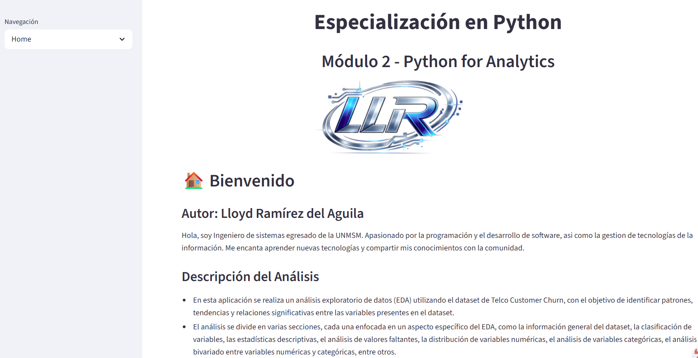
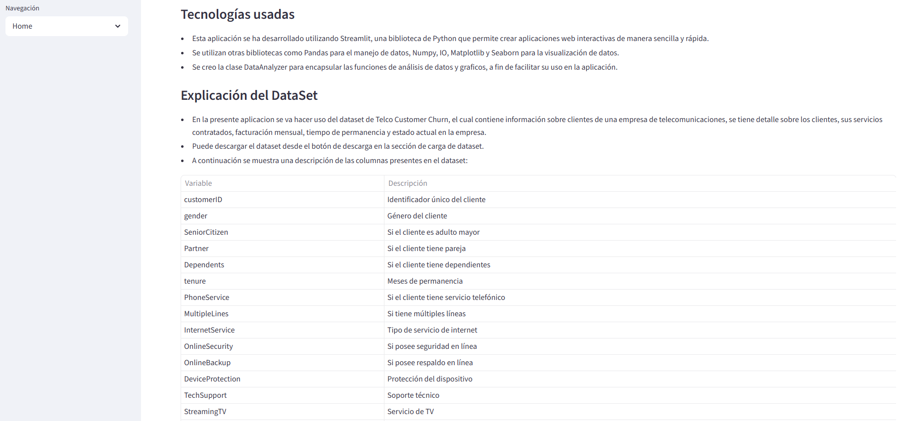

# Aplicacion que permite hacer el Analisis Exploratorio de Datos (EDA) de un dataset

# 📊 Se usa como caso de estudio el dataset: Telco Customer Churn

- Es una aplicación interactiva desarrollada en **Python + Streamlit** para analizar la fuga de clientes (churn) en una empresa de telecomunicaciones.  
- Permite cargar datasets, visualizar estadísticas, explorar los datos y generar conclusiones sobre las causas de abandono.

## 📝 Descripción del proyecto
El objetivo de esta aplicación es:
- Analizar datos de clientes y detectar patrones asociados al **churn (Si el cliente abandonó la empresa)**.
- Tambien se puede analizar cualquier dataset aunque algunas opciones estan restringidas pra el caso de estudio.
- Facilitar la exploración de variables mediante tablas, métricas y visualizaciones.
- Servir como herramienta práctica para el aprendizaje de **Streamlit** , **Python orientado a objetos y analisis de datos**.
- Se podria agregar mejoras en especial a la parte de conclusiones y variable objetivo a evaluar, a fin de que la misma sea variable y sirva para cualquier dataset.

## 📸 Capturas de la aplicación
En la parte izquierda de la aplicación se muestra un menu de navegacion sobre las opciones disponibles: Home (Pantalla Principal), Cargar Dataset (Permite descargar el dataset de ejemplo y cargar el mismo a la aplicacion o cargar un dataset propio) y EDA (Contiene opciones para realizar el analisis respectivo del dataset).
### Pantalla principal:

### Opcion para Cargar el Dataset:

### Visualización de métricas

## ⚙️ Instrucciones de ejecución:
Ingresar a la siguiente ruta para probar la aplicacion:
https://edallr.streamlit.app/

##  📂 Repositorio:
https://github.com/vakerlloyd/eda

## 👨‍💻 Autor
Proyecto desarrollado por **Lloyd Ramirez del Aguila** como parte de aprendizaje en Python, Streamlit y análisis de datos.
